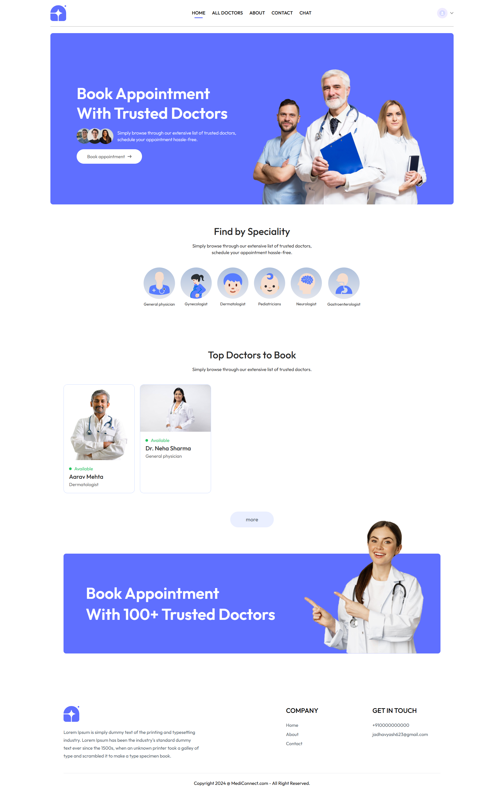

# MediConnect-UI

## Overview

MediConnect-UI is a modern, user-friendly front-end interface for a medical appointment and communication platform, designed for patients to interact seamlessly with healthcare providers. Built with **React**, **Vite**, and **Tailwind CSS**, it offers a responsive and intuitive experience. The interface integrates with the MediConnect-API to enable appointment booking, real-time chat, and profile management, with a focus on usability and scalability.

## Hosted Application

You can access the live application at [MediConnect-UI](https://medi-connect-ui-three.vercel.app/).

## Features

- **Doctor Directory**: Browse and search doctors by specialty, view detailed profiles, and explore top-rated practitioners.
- **Appointment Booking**: Schedule, view, and manage upcoming and past appointments with doctors.
- **Secure Authentication**: Safe and streamlined login and registration for patients, including verification flows.
- **Profile Management**: Update personal details, contact information, and medical history in a user-friendly interface.
- **Real-time Chat**: Communicate directly with doctors through private, socket-based chat rooms.
- **Modern UI Components**: Includes polished banners, navigation, footers, and layouts for a cohesive experience.
- **Notifications**: Toast notifications provide instant feedback for actions and errors.


## Screenshots

Below are some screenshots showcasing the main features and UI of MediConnect-UI:

### Home Page



### About Page


### Appointments


### Chats


### Contact Us


### Login


### Profile


### Signup


## Tech Stack

- **Frontend**: React, Vite, Tailwind CSS
- **Real-time Communication**: Socket.IO
- **Version Control**: Git
- **Hosting**: GitHub, Vercel

## Prerequisites

Before setting up the project, ensure you have:

- [Node.js](https://nodejs.org/) (v16 or higher)
- [Git](https://git-scm.com/)
- A modern web browser (e.g., Chrome, Firefox)
- Access to the [MediConnect-API](https://github.com/Lord-Vesta/MediConnect-API) for backend functionality

## Installation

To set up MediConnect-UI locally, follow these steps:

1. **Clone the Repository**:

   ```bash
   git clone https://github.com/Lord-Vesta/MediConnect-UI.git
   ```

2. **Navigate to the Project Directory**:

   ```bash
   cd MediConnect-UI
   ```

3. **Install Dependencies**:

   ```bash
   npm install
   ```

4. **Set Up Environment Variables**:
   Create a `.env` file in the root directory and configure the API endpoint:

   ```plaintext
   VITE_BACKEND_URL= http://localhost:5000/
   ```

   Ensure the [MediConnect-API](https://github.com/Lord-Vesta/MediConnect-API) is running and accessible.

5. **Run the Development Server**:

   ```bash
   npm run dev
   ```

6. **Open the Application**:
   Open your browser and navigate to `http://localhost:5173` (or the port shown in the terminal).


## License

This project is licensed under the MIT License. See the [LICENSE](LICENSE) file for details.

## Contact

For questions or feedback, reach out to the project maintainer at [yash1302](https://github.com/yash1302/).
